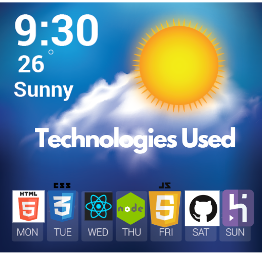
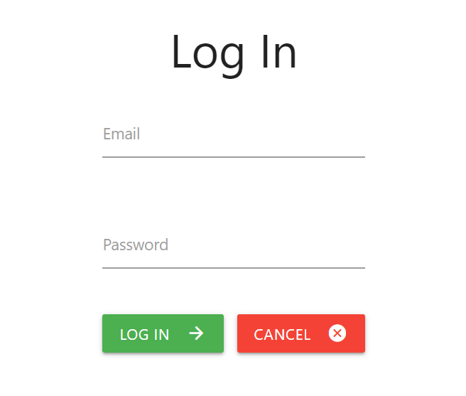
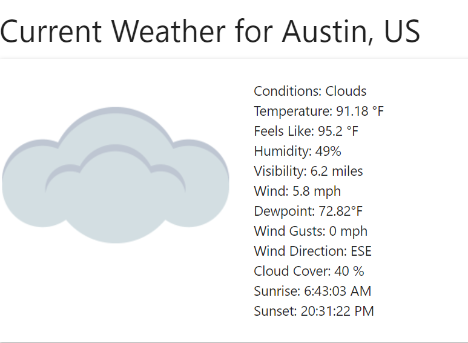

### Date: 7/21/2020

#### By: Brandon Sacco
#### [LinkedIn](https://www.linkedin.com/in/brandonsacco/) | 

### ***Description***

##### A full-stack MERN application for tracking the weather, and saving locations for at a glance weather forcasting.
***

### ***Technologies Used***

### ***Getting Started***

##### Start by signing up a new user and then that user can search for any location they wish to see the where in. From there that use can then create a libary of saved locations to view the weather at a glance. 
##### A Trello board was used to keep track of development progress and can be viewed [here](https://trello.com/b/KePTxNPl/weather-or-not).
##### The project itself was deployed using Heroku and can be viewed [here](https://weather-or-nott.herokuapp.com/).
***

### ***Screenshots***

###### Welcome Page

###### Weather Screen

### ***Future Updates***

- [x] ~~Make app scale for mobile~~
- [ ] Add Dark Mode
- [ ] Add Light Mode
- [ ] Add an Allergy Tracker
- [ ] Add Weather Advisory 
***

### ***Personal Thanks***

##### I truly want to thank the following people for without them this project would of been not possible: Ben Manley - Samuel Gemberling - Samuel Trahan - David Stinson - and a shout out to my inspiration for the project, Nancy and George who always push me to just be better than who I was yesterday.

***